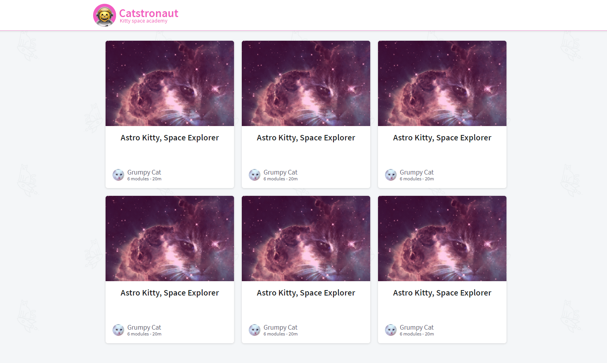

# Catstronauts

Apollo's Lift-off course companion app (completed)

[Live Demo App](https://lift-off-client-demo.netlify.app/)

[Course Walk-through on Odyssey](https://odyssey.apollographql.com/lift-off-part1)

## Overview

In attempt to gain better understanding of the works of GraphQL and Apollo Server to become a more attactive candidate for employers, I have worked my way through the first (and currently only available) tutorial: "Catstronauts"! 😺😺😺😺😺 

After building our Schema, we utilize Graph QL and Apollo Server to send and receive mock data, and fill the cards with it.  In future tutorials we will connect to live data and make our display a little more dynamic.  As new tutorials are released through Apollo's website, I will add to this repo.

## Run the project

Catstronauts full-stack app holds two main folders `server` and `client`.

### server

- install packages `cd server && npm install`
- start server `npm start`

The GraphQL server pulls data from a REST API.

### client

From another terminal window:

- install packages `cd client && npm install`
- start React app `npm start`
